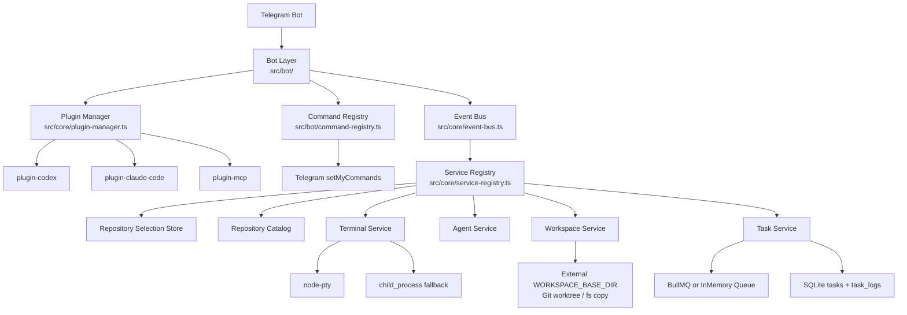

# Telegram AI Manager

**EN**: Telegram Bot UI for managing Codex CLI and Claude Code CLI terminal sessions on your local machine.

**ZH**: 通过 Telegram Bot 统一管理本机 Codex CLI 和 Claude Code CLI 终端会话的前端界面。

---

## 快速启动 / Quick Start

```bash
# 1. 复制环境变量模板
cp .env.example .env
# 编辑 .env，填写 TELEGRAM_BOT_TOKEN、TELEGRAM_ALLOWED_USERS、
# DEFAULT_WORKSPACE_SOURCE_PATH、WORKSPACE_BASE_DIR 等配置

# 2. 安装依赖
pnpm install

# 3. 受管开发启动（后台单实例）
pnpm dev

# 4. 查看状态 / 停止
pnpm status
pnpm stop

# 5. 生产构建并受管启动
pnpm build && pnpm start
```

---

## 相关文档 / Documents

- [MVP 实现状态与文档闭环清单](docs/mvp-implementation-plan.md)
- [Claude Code 协作规范](CLAUDE.md)
- [Codex / Agent 协作规范](AGENTS.md)

---

## 当前能力 / Current Capabilities

- Telegram 命令菜单会在启动时自动注册：`/start`、`/repos`、`/task`、`/status`、`/logs`、`/cancel`、`/submit`、`/merge`、`/push`、`/clear`、`/reset`、`/codex`、`/claude`
- `/repos` 会扫描 `DEFAULT_WORKSPACE_SOURCE_PATH` 直接子目录下可识别的 Git 仓库；选中后，后续 `/task`、`/codex`、`/claude` 和自由文本默认作用于该仓库
- `/task` 和自由文本会使用默认 Agent（当前为 `codex`）；`/codex`、`/claude` 则显式绑定对应 CLI
- 若当前未选择仓库，`/task`、`/codex`、`/claude` 会回退使用 `DEFAULT_WORKSPACE_SOURCE_PATH`；也支持通过 `workspace::prompt` 显式指定目标路径
- Git 仓库默认使用独立 `git worktree` 隔离任务；非 Git 目录才回退为目录复制
- 任务重试前会自动清理同 task id 的残留 worktree 注册；启动恢复时，`queued` 任务会重新入队、原 `running` 任务会标记为失败并回收 workspace；失败或取消任务同样会自动回收，成功任务会保留 worktree 以便后续发布
- 任务状态和历史输出持久化到 SQLite，`/logs` 支持查看历史输出
- `MessageHistoryStore` 会把机器人消息 id 持久化到 `data/message-history.json` 以支持 `/clear`、`/reset`；当前选中仓库和两步输入状态仅保存在内存中，进程重启后会清空
- Redis 不可用时，任务队列自动降级为内存模式
- `node-pty` 启动失败时，终端层会自动回退到 `child_process.spawn`
- Codex 任务默认不回传中间过程，只在完成时返回最终结果；成功的 Git 任务会附带 task id、分支、worktree 信息和下一步 `/submit`、`/merge`、`/push` 提示；成功的非 Git 任务只返回 workspace 路径；若未提取到最终输出，则引导使用 `/logs`
- Git 任务才会进入 `/submit`、`/merge`、`/push` 发布流；非 Git 任务不显示发布按钮
- 任务完成后 Telegram 只先提供“提交分支”按钮；提交成功后再提供 `merge` 按钮，合并成功后再提供 `push` 按钮，其中 `merge`、`push` 按钮采用“先确认、再执行”的交互；直接输入文本命令则立即执行
- `/clear`、`/clear all`、`/reset` 用于清理机器人消息、仓库选择和活跃任务上下文
- 本地运行改为单实例受管模式：`pnpm dev` 会清理旧进程、写入 PID/日志、检查 readiness
- 运行状态通过本地健康端口暴露，默认只监听 `127.0.0.1:43117`
- `plugin-mcp` 当前仍是预留插件，不注册用户可见命令

---

## 交互流程 / Runtime Flow

1. 通过 `/repos` 列出 `DEFAULT_WORKSPACE_SOURCE_PATH` 直接子目录中的 Git 仓库并选择目标仓库
2. 使用 `/codex [workspace::]prompt`、`/claude [workspace::]prompt`、`/task [workspace::]prompt` 或直接发送文本创建任务；`/task` 和自由文本默认走 `codex`
3. 若未选择仓库，则任务默认回退到 `DEFAULT_WORKSPACE_SOURCE_PATH`；若使用 `workspace::prompt`，则以显式路径为准
4. `TaskRunner` 为每个任务创建独立工作目录
5. Git 仓库走 `git worktree`，目录路径固定在仓库外部的 `WORKSPACE_BASE_DIR`；非 Git 目录回退为目录复制
6. Agent 在隔离 worktree 中运行；Codex 默认只在完成后回传最终结果，其他输出仍会写入任务日志并遵守 ANSI 清理、去抖和 4096 字符分片约束
7. 成功的 Git 任务会保留 worktree 并返回 `task_id`、分支名、worktree 路径，可通过 `/submit <task_id>` 提交任务分支，再用 `/merge <task_id>` 合入本地 `main`；成功的非 Git 任务只返回 workspace 路径
8. `/push <task_id>` 会把本地 `main` 推到 `origin/main`；push 成功后自动删除该任务的本地 worktree，并返回清理结果
9. `/merge` 和 `/push` 只做安全校验后的分步发布，不自动 rebase、不强制 merge；文本命令直接执行，Telegram 按钮会先弹确认再真正执行
10. 启动恢复时，历史 `queued` 任务会重新入队；历史 `running` 任务会被标记为失败并清理对应 workspace
11. `RepositorySelectionStore` 和两步输入状态只保存在进程内存；`MessageHistoryStore` 会把机器人消息 id 持久化到 `data/message-history.json`，供 `/clear`、`/reset` 使用
12. 使用 `/status`、`/logs`、`/cancel`、`/submit`、`/merge`、`/push`、`/clear`、`/reset` 管理当前会话

---

## 本地运行 / Local Runtime

- `pnpm dev`：受管后台启动本地实例，自动清理旧 PID 和旧 bot 进程
- `pnpm dev:watch`：保留原始 `tsx watch` 调试模式，不建议作为日常本地测试默认入口
- `pnpm start`：受管方式启动 `dist/index.js`，通常先执行 `pnpm build`
- `pnpm stop`：优雅停止当前项目实例，必要时清理僵尸进程
- `pnpm status`：显示 PID、日志路径和健康检查地址
- 运行时文件统一放在 `.runtime/telegram-ai-manager/local/`
- SQLite 默认文件路径：`data/tasks.db`
- 机器人消息历史文件：`data/message-history.json`
- 运行时状态文件：`.runtime/telegram-ai-manager/local/state/health.env`
- 默认健康检查地址：`http://127.0.0.1:43117/healthz`
- 默认日志路径：`.runtime/telegram-ai-manager/local/logs/app.log`
- 当前已选仓库和两步输入状态不落盘，进程重启后需要重新选择仓库或重新发起两步输入

---

## 命令说明 / Bot Commands

| 命令 | 说明 |
|------|------|
| `/start` | 显示欢迎信息和命令列表 |
| `/repos` | 列出并选择 `DEFAULT_WORKSPACE_SOURCE_PATH` 直接子目录下的 Git 仓库 |
| `/task [workspace::]prompt` | 在当前已选仓库中创建默认 Agent 任务（当前默认是 `codex`），也可显式覆盖路径 |
| `/codex [workspace::]prompt` | 在当前已选仓库中创建 Codex CLI 任务，也可显式覆盖路径 |
| `/claude [workspace::]prompt` | 在当前已选仓库中创建 Claude Code CLI 任务，也可显式覆盖路径 |
| `/status` | 查看当前已选仓库、活跃任务、worktree 路径和最近错误 |
| `/logs [task_id]` | 查看当前用户最近任务或指定任务的历史输出 |
| `/cancel [task_id]` | 取消指定任务；省略 `task_id` 时取消当前用户最近一条排队中或运行中的任务 |
| `/submit [task_id] [message]` | 提交指定任务的本地分支；省略 `task_id` 时默认选择最近一条可提交 Git 任务，并使用默认 commit message |
| `/merge [task_id]` | 将最近一条可 merge 的 Git 任务，或指定任务的分支 fast-forward 合并到本地 `main` |
| `/push [task_id]` | 将最近一条可 push 的 Git 任务对应仓库的本地 `main` 推送到 `origin/main`，成功后自动清理任务 worktree |
| `/clear` | 清空当前聊天中的机器人消息并重置仓库选择 |
| `/clear all` | 清空机器人消息、取消当前用户的活跃任务，并重置仓库选择 |
| `/reset` | 清空消息、取消活跃任务并重置当前会话 |

说明：`/task`、`/codex`、`/claude` 支持两步输入，可以先发命令，再把下一条文本作为任务内容；`/task` 和自由文本会使用默认 Agent（当前为 `codex`）。若未选择仓库，则默认回退到 `DEFAULT_WORKSPACE_SOURCE_PATH`；使用 `workspace::prompt` 可直接指定任意本地目录。`/repos` 只扫描 `DEFAULT_WORKSPACE_SOURCE_PATH` 的直接子目录，因此如果把该路径直接指向某个仓库根目录，仓库本身不会出现在 `/repos` 菜单里，此时依赖默认路径回退或 `workspace::prompt`。`/logs` 省略 `task_id` 时读取当前用户最近一条任务，`/cancel` 省略 `task_id` 时取消最近一条活跃任务。`/submit`、`/merge`、`/push` 仅适用于 Git 任务；任务完成后的按钮顺序固定为 `submit -> merge -> push`。其中 Telegram 按钮会先确认再执行，直接输入文本命令则立即执行；若要为 `/submit` 自定义 commit message，当前实现必须显式传入 `task_id`。

### 发布流程 / Publishing Flow

- `/submit [task_id] [message]`：默认选择当前用户最近一条仍保留 Git worktree 的可提交任务；省略 `task_id` 时会使用默认提交信息 `chore(task): submit <task_id>`；若要自定义 message，当前实现必须显式传入 `task_id`
- `/merge [task_id]`：默认选择最近一条可 merge 的 Git 任务，只允许把 `task/<task_id>` fast-forward 合并到本地 `main`
- `/push [task_id]`：默认选择最近一条可 push 的 Git 任务，要求任务分支已经进入本地 `main`，并且仓库存在 `origin`
- `/push` 成功后只清理该任务的本地 worktree，并将任务记录里的 `workspacePath` 置空；任务分支默认保留，方便后续排查或人工处理
- 非 Git 任务不会显示发布按钮，也不能使用 `/submit`、`/merge`、`/push`
- Telegram 按钮路径会在执行 `/merge`、`/push` 之前弹确认；直接输入文本命令不会额外二次确认
- 只要主仓库不在 `main`、主仓库有脏改动、任务 worktree 仍有未提交改动、任务分支不存在或无法 fast-forward，发布流程都会直接阻断并返回原因

---

## 架构图 / Architecture



---

## 目录结构

```
src/
├── core/          # 抽象层：EventBus, PluginManager, ServiceRegistry, types
├── services/      # 业务服务：terminal/, agent/, workspace/, task/
├── bot/           # Telegram Bot：commands/, handlers/, middleware/
├── plugins/       # 自包含插件：plugin-codex/, plugin-claude-code/, plugin-mcp/
└── shared/        # 通用工具：logger, constants, utils

tests/             # 测试镜像目录（与 src/ 结构对应）
hooks/             # Git hooks 脚本
.claude/           # Claude Code 配置：agents/, commands/, settings.json
.codex/            # Codex CLI 配置
data/              # SQLite 数据目录（gitignored）
.runtime/          # 本地运行时 PID / log / state 目录（gitignored）
```

---

## 环境变量要点 / Environment Notes

- `DEFAULT_WORKSPACE_SOURCE_PATH`：Telegram `/repos` 只扫描这个目录的直接子目录；未选择仓库时它也是任务默认目标路径。如果它本身就是某个仓库根目录，则该仓库不会出现在 `/repos` 菜单里
- `WORKSPACE_BASE_DIR`：任务 worktree 根目录，必须放在源仓库目录外部
- `TELEGRAM_ALLOWED_USERS`：允许访问 bot 的 Telegram 数字 user id 列表
- `CODEX_CLI_PATH`、`CLAUDE_CODE_CLI_PATH`：本机 CLI 可执行路径
- `CODEX_CLI_ARGS`、`CLAUDE_CODE_CLI_ARGS`：附加 CLI 参数，按空白拆分后会追加在内置参数前面
- `GIT_BRANCH_ISOLATION`：控制临时 Git workspace 回收时是否顺带删除 `task/<task_id>` 分支；`/push` 成功后的 retained worktree 清理仍默认保留任务分支
- `REDIS_URL`：配置项必填；Redis 服务不可用时自动降级为内存队列
- `TASK_CONCURRENCY`：Redis 队列模式下的 worker 并发度；降级到内存队列后按顺序串行处理
- `RUNTIME_HEALTH_HOST`、`RUNTIME_HEALTH_PORT`：本地健康检查地址，默认 `127.0.0.1:43117`
- `LOG_LEVEL`：pino 日志级别，支持 `fatal`、`error`、`warn`、`info`、`debug`、`trace`

---

## 插件开发

详见 [src/plugins/CLAUDE.md](src/plugins/CLAUDE.md)。

快速创建新插件：

```bash
# 使用 Claude Code 自定义命令
/new-plugin <plugin-name>
```

---

## 多 Agent 协作

本项目支持 Claude Code 和 Codex CLI 同时工作：

| 工具 | 配置文件 | 适合任务 |
|------|----------|----------|
| Claude Code | CLAUDE.md + .claude/ | 架构设计、复杂重构、代码审查 |
| Codex CLI | AGENTS.md + .codex/ | 快速功能实现、bug 修复、测试补充 |

### 协作流程

1. 用 Claude Code 做架构决策和复杂模块开发（`/plan` → 实现 → `/preflight`）
2. 用 Codex 并行处理独立功能、测试和文档闭环
3. 修改 Bot 行为、命令面、workspace 生命周期、运行脚本或本地启动方式时，同步更新 `README.md`、`CLAUDE.md`、`AGENTS.md` 和相关 `.claude/` 文档
4. 每个 Agent 在独立 Git 分支工作，通过 PR 合并
5. 使用 subagent `architect`、`reviewer`、`tester` 审查实现、质量和测试

### Claude Code Subagents

- **architect** — 架构合规审查
- **reviewer** — 代码质量审查
- **tester** — 测试生成与运行

### 自定义命令

- `/plan <task>` — 生成分阶段实施计划
- `/new-plugin <name>` — 创建新插件骨架
- `/sync-agents` — 同步 CLAUDE.md 与 AGENTS.md
- `/preflight` — 提交前完整预检查
