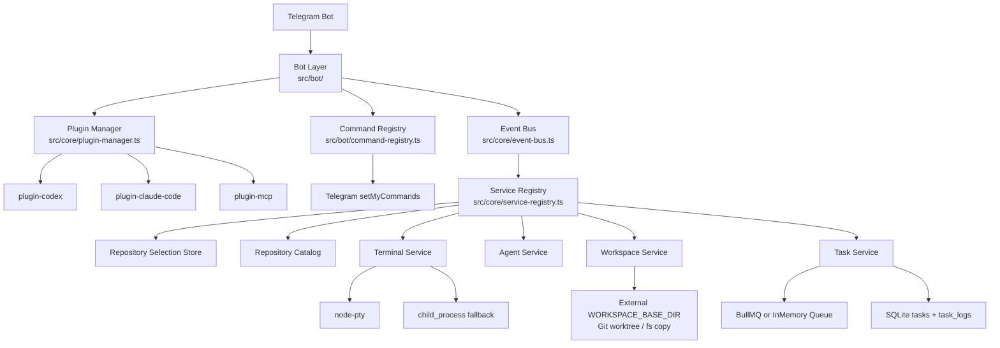

# Telegram AI Manager

**EN**: Telegram Bot UI for managing Codex CLI and Claude Code CLI terminal sessions on your local machine.

**ZH**: 通过 Telegram Bot 统一管理本机 Codex CLI 和 Claude Code CLI 终端会话的前端界面。

---

## 快速启动 / Quick Start

```bash
# 1. 复制环境变量模板
cp .env.example .env
# 编辑 .env，填写 TELEGRAM_BOT_TOKEN、TELEGRAM_ALLOWED_USERS、
# DEFAULT_WORKSPACE_SOURCE_PATH、WORKSPACE_BASE_DIR 等配置

# 2. 安装依赖
pnpm install

# 3. 受管开发启动（后台单实例）
pnpm dev

# 4. 查看状态 / 停止
pnpm status
pnpm stop

# 5. 生产构建并受管启动
pnpm build && pnpm start
```

---

## 相关文档 / Documents

- [MVP 全量实现计划](docs/mvp-implementation-plan.md)
- [Claude Code 协作规范](CLAUDE.md)
- [Codex / Agent 协作规范](AGENTS.md)

---

## 当前能力 / Current Capabilities

- Telegram 命令菜单会在启动时自动注册：`/start`、`/repos`、`/task`、`/status`、`/logs`、`/cancel`、`/clear`、`/reset`、`/codex`、`/claude`
- 用户先通过 `/repos` 选择 `DEFAULT_WORKSPACE_SOURCE_PATH` 下的仓库，再发送任务 prompt
- Git 仓库默认使用独立 `git worktree` 隔离任务；非 Git 目录才回退为目录复制
- 任务状态和历史输出持久化到 SQLite，`/logs` 支持查看历史输出
- Redis 不可用时，任务队列自动降级为内存模式
- `node-pty` 启动失败时，终端层会自动回退到 `child_process.spawn`
- `/clear`、`/clear all`、`/reset` 用于清理机器人消息、仓库选择和活跃任务上下文
- 本地运行改为单实例受管模式：`pnpm dev` 会清理旧进程、写入 PID/日志、检查 readiness
- 运行状态通过本地健康端口暴露，默认只监听 `127.0.0.1:43117`

---

## 交互流程 / Runtime Flow

1. 通过 `/repos` 列出 `DEFAULT_WORKSPACE_SOURCE_PATH` 下的 Git 仓库并选择目标仓库
2. 使用 `/codex <prompt>`、`/claude <prompt>`、`/task <prompt>` 或直接发送文本创建任务
3. `TaskRunner` 为每个任务创建独立工作目录
4. Git 仓库走 `git worktree`，目录路径固定在仓库外部的 `WORKSPACE_BASE_DIR`
5. Agent 在隔离 worktree 中运行，输出经过 ANSI 清理、防抖和 4096 字符分片后推送到 Telegram
6. 使用 `/status`、`/logs`、`/cancel`、`/clear`、`/reset` 管理当前会话

---

## 本地运行 / Local Runtime

- `pnpm dev`：受管后台启动本地实例，自动清理旧 PID 和旧 bot 进程
- `pnpm dev:watch`：保留原始 `tsx watch` 调试模式，不建议作为日常本地测试默认入口
- `pnpm start`：受管方式启动 `dist/index.js`
- `pnpm stop`：优雅停止当前项目实例，必要时清理僵尸进程
- `pnpm status`：显示 PID、日志路径和健康检查地址
- 运行时文件统一放在 `.runtime/telegram-ai-manager/local/`
- 默认健康检查地址：`http://127.0.0.1:43117/healthz`
- 默认日志路径：`.runtime/telegram-ai-manager/local/logs/app.log`

---

## 命令说明 / Bot Commands

| 命令 | 说明 |
|------|------|
| `/start` | 显示欢迎信息和命令列表 |
| `/repos` | 列出并选择 `DEFAULT_WORKSPACE_SOURCE_PATH` 下的仓库 |
| `/task <prompt>` | 在当前已选仓库中创建默认 Agent 任务 |
| `/codex <prompt>` | 在当前已选仓库中创建 Codex CLI 任务 |
| `/claude <prompt>` | 在当前已选仓库中创建 Claude Code CLI 任务 |
| `/status` | 查看当前已选仓库、活跃任务、worktree 路径和最近错误 |
| `/logs [task_id]` | 查看最近任务或指定任务的历史输出 |
| `/cancel [task_id]` | 取消排队中或运行中的任务 |
| `/clear` | 清空当前聊天中的机器人消息并重置仓库选择 |
| `/clear all` | 清空机器人消息并取消当前用户的活跃任务 |
| `/reset` | 清空消息、取消活跃任务并重置当前会话 |

说明：`/task`、`/codex`、`/claude` 支持两步输入，可以先发命令，再把下一条文本作为任务内容。

---

## 架构图 / Architecture



---

## 目录结构

```
src/
├── core/          # 抽象层：EventBus, PluginManager, ServiceRegistry, types
├── services/      # 业务服务：terminal/, agent/, workspace/, task/
├── bot/           # Telegram Bot：commands/, handlers/, middleware/
├── plugins/       # 自包含插件：plugin-codex/, plugin-claude-code/, plugin-mcp/
└── shared/        # 通用工具：logger, constants, utils

tests/             # 测试镜像目录（与 src/ 结构对应）
hooks/             # Git hooks 脚本
.claude/           # Claude Code 配置：agents/, commands/, settings.json
.codex/            # Codex CLI 配置
data/              # SQLite 数据目录（gitignored）
.runtime/          # 本地运行时 PID / log / state 目录（gitignored）
```

---

## 环境变量要点 / Environment Notes

- `DEFAULT_WORKSPACE_SOURCE_PATH`：Telegram `/repos` 扫描仓库的根目录
- `WORKSPACE_BASE_DIR`：任务 worktree 根目录，必须放在源仓库目录外部
- `TELEGRAM_ALLOWED_USERS`：允许访问 bot 的 Telegram 数字 user id 列表
- `CODEX_CLI_PATH`、`CLAUDE_CODE_CLI_PATH`：本机 CLI 可执行路径
- `REDIS_URL`：可选；未配置或不可用时自动降级为内存队列
- `RUNTIME_HEALTH_HOST`、`RUNTIME_HEALTH_PORT`：本地健康检查地址，默认 `127.0.0.1:43117`

---

## 插件开发

详见 [src/plugins/CLAUDE.md](src/plugins/CLAUDE.md)。

快速创建新插件：

```bash
# 使用 Claude Code 自定义命令
/new-plugin <plugin-name>
```

---

## 多 Agent 协作

本项目支持 Claude Code 和 Codex CLI 同时工作：

| 工具 | 配置文件 | 适合任务 |
|------|----------|----------|
| Claude Code | CLAUDE.md + .claude/ | 架构设计、复杂重构、代码审查 |
| Codex CLI | AGENTS.md + .codex/ | 快速功能实现、bug 修复、测试补充 |

### 协作流程

1. 用 Claude Code 做架构决策和复杂模块开发（`/plan` → 实现 → `/preflight`）
2. 用 Codex 并行处理独立功能、测试和文档闭环
3. 修改 Bot 行为、命令面、workspace 生命周期、运行脚本或本地启动方式时，同步更新 `README.md`、`CLAUDE.md`、`AGENTS.md` 和相关 `.claude/` 文档
4. 每个 Agent 在独立 Git 分支工作，通过 PR 合并
5. 使用 subagent `architect`、`reviewer`、`tester` 审查实现、质量和测试

### Claude Code Subagents

- **architect** — 架构合规审查
- **reviewer** — 代码质量审查
- **tester** — 测试生成与运行

### 自定义命令

- `/plan <task>` — 生成分阶段实施计划
- `/new-plugin <name>` — 创建新插件骨架
- `/sync-agents` — 同步 CLAUDE.md 与 AGENTS.md
- `/preflight` — 提交前完整预检查
