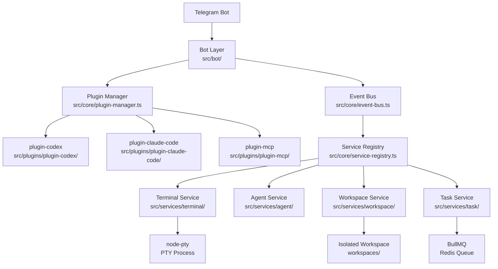

# Telegram AI Manager

**EN**: Telegram Bot UI for managing Codex CLI and Claude Code CLI terminal sessions on your local machine.

**ZH**: 通过 Telegram Bot 统一管理本机 Codex CLI 和 Claude Code CLI 终端会话的前端界面。

---

## 快速启动 / Quick Start

```bash
# 1. 复制环境变量模板
cp .env.example .env
# 编辑 .env，填写 TELEGRAM_BOT_TOKEN 等配置

# 2. 安装依赖
pnpm install

# 3. 开发模式启动
pnpm dev

# 4. 生产构建
pnpm build && pnpm start
```

---

## 相关文档 / Documents

- [MVP 全量实现计划](docs/mvp-implementation-plan.md)

---

## 架构图 / Architecture



---

## 目录结构

```
src/
├── core/          # 抽象层：EventBus, PluginManager, ServiceRegistry, types
├── services/      # 业务服务：terminal/, agent/, workspace/, task/
├── bot/           # Telegram Bot：commands/, handlers/, middleware/
├── plugins/       # 自包含插件：plugin-codex/, plugin-claude-code/, plugin-mcp/
└── shared/        # 通用工具：logger, constants, utils

tests/             # 测试镜像目录（与 src/ 结构对应）
hooks/             # Git hooks 脚本
.claude/           # Claude Code 配置：agents/, commands/, settings.json
.codex/            # Codex CLI 配置
workspaces/        # 任务隔离工作区（gitignored）
```

---

## 插件开发

详见 [src/plugins/CLAUDE.md](src/plugins/CLAUDE.md)。

快速创建新插件：

```bash
# 使用 Claude Code 自定义命令
/new-plugin <plugin-name>
```

---

## 多 Agent 协作

本项目支持 Claude Code 和 Codex CLI 同时工作：

| 工具 | 配置文件 | 适合任务 |
|------|----------|----------|
| Claude Code | CLAUDE.md + .claude/ | 架构设计、复杂重构、代码审查 |
| Codex CLI | AGENTS.md + .codex/ | 快速功能实现、bug 修复、测试补充 |

### 协作流程

1. 用 Claude Code 做架构决策和复杂模块开发（`/plan` → 实现 → `/preflight`）
2. 用 Codex 并行处理独立的功能任务和测试
3. 每个 Agent 在独立 Git 分支工作，通过 PR 合并
4. 使用 subagent `architect` 审查跨 Agent 的改动是否冲突

### Claude Code Subagents

- **architect** — 架构合规审查
- **reviewer** — 代码质量审查
- **tester** — 测试生成与运行

### 自定义命令

- `/plan <task>` — 生成分阶段实施计划
- `/new-plugin <name>` — 创建新插件骨架
- `/sync-agents` — 同步 CLAUDE.md 与 AGENTS.md
- `/preflight` — 提交前完整预检查
